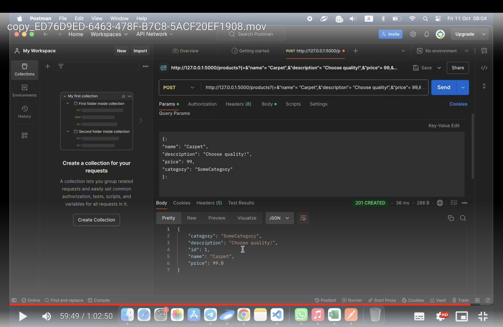
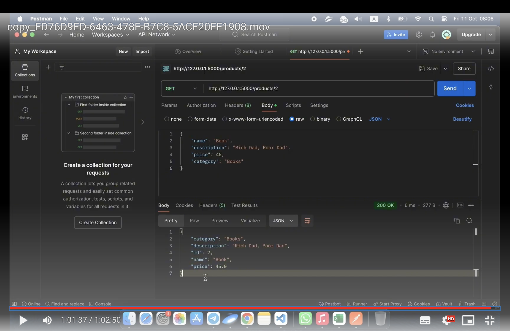

# Task: Developing a REST API for Product Management

**Customer company:** Acme Corp

**Task Overview:**

This project involves developing a REST API for managing products in a supply chain management system. The API is built using Python's Flask framework and SQLite for data storage.

**Additional Requirements:**

- Deploying the web application on a local server using Flask and SQLite.
- API Methods:
  - `POST /products`: Adds a new product to the database.
  - `GET /products`: Retrieves a list of all products, with optional filtering by category and sorting by price.
  - `GET /products/:id`: Retrieves detailed information about a specific product.
- Use SQLite as the database for simplicity.

## How to Use and Run the Project

### Prerequisites

- Python 3.7 or higher
- Virtual environment (optional but recommended)
- Git (to clone the repository)

### Project Setup

1. **Clone the repository:**

   ```bash
   git clone https://github.com/your_username/flask-products-api.git
   cd flask-products-api

2. **Clone the repository:**
    ```bash
    python -m venv venv


3. Make sure you have Flask and SQLAlchemy installed. Install them using:

```
pip install -r requirements.txt
Create the SQLite database:
```

The database will be automatically created when you run the application for the first time, or you can manually create it using:

```
```>>> from app import db
>>> db.create_all()
>>> exit()
```

Running the Application
Start the Flask server:


```python app.py```


Access the API:

The server will run on ```http://localhost:5000.``` You can now use tools like Postman, cURL, or your browser to interact with the API.

API Endpoints
Create a new product (POST /products):

```
URL: http://localhost:5000/products

Method: POST

Request Body: JSON
```

Example:

```
{
    "name": "Laptop",
    "description": "A high-performance laptop",
    "price": 999.99,
    "category": "Electronics"
}
```
Response: Returns the created product's details:

```{
    "id": 1,
    "name": "Laptop",
    "description": "A high-performance laptop",
    "price": 999.99,
    "category": "Electronics"
}
```

Get a list of products (GET /products):

```
URL: http://localhost:5000/products

Method: GET

Query Parameters:

category (optional): Filter products by category.
sort (optional): Sort products by price (?sort=price).
Example: http://localhost:5000/products?category=Electronics&sort=price
```

Response: Returns a list of products:

```[
    {
        "id": 1,
        "name": "Laptop",
        "description": "A high-performance laptop",
        "price": 999.99,
        "category": "Electronics"
    }
]
Get a specific product (GET /products/
):
```

```
URL: http://localhost:5000/products/1

Method: GET

Response: Returns the product's details:
```

```
{
    "id": 1,
    "name": "Laptop",
    "description": "A high-performance laptop",
    "price": 999.99,
    "category": "Electronics"
}
```
Error Handling: If the product with the specified ID is not found, it returns a 404 status code with a message:


```{
    "error": "Product not found"
}
```
Deleting All Products (Manual Method)
To delete all products from the database manually:

Open a Python shell in the project directory:


python
Delete all products:

```
from app import db, Product
db.session.query(Product).delete()
db.session.commit()
```
Exit the shell:
```exit()```

## Screenshots 
Adding product with row data


Retrieving Product



## Video Description of Work
https://drive.google.com/file/d/1VnNjyIIifDZYFUuYSD1vRAPsrGohXdAi/view?usp=drive_link


